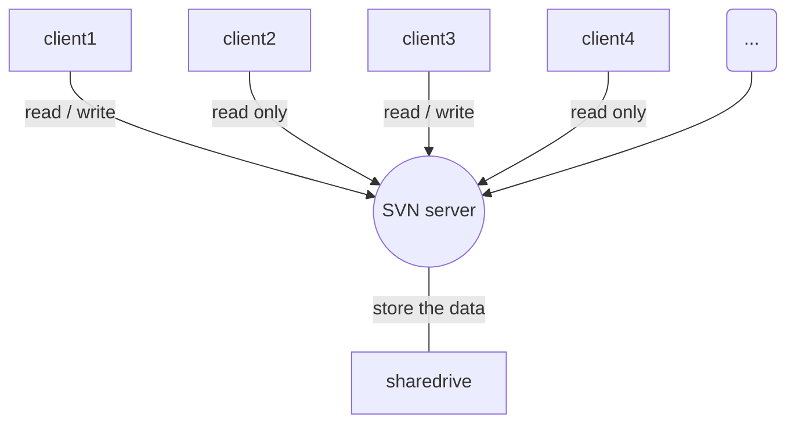

# PCBDetect
基于Qt5和OpenCV3的PCB缺陷检测系统

**开发环境：**  
Visual Studio 2017 Professional  
Qt 5.11.1  
OpenCV contrib 3.4.3

**主要模块：**  
运动控制、相机控制、人机交互界面、核心算法（模板提取算法、缺陷检测算法）、字符识别（OCR）  

**文件说明：**  

| 文件 | 说明 |
| :---: | :---: |
| PCBDetect (.h/.cpp) | 程序主界面 |
| Configurator (.h/.cpp) | 参数配置器 |
| LaunchUI (.h/.cpp) | 启动界面 |
| LaunchUI.ui | 启动界面的外观设计和控件布局 |
| SysInitThread (.h/.cpp) | 系统初始化线程，启动过程中在后台执行初始化操作 |
| SettingUI (.h/.cpp) | 参数设置界面 |
| SettingUI.ui | 参数设置界面的外观设计和控件布局 |
| TemplateUI (.h/.cpp) | 模板提取界面 |
| TemplateUI.ui | 模板提取界面的外观设计和控件布局 |
| TemplateThread (.h/.cpp) | 模板提取线程 |
| TemplateExtractor (.h/.cpp) | 模板提取器 |
| TemplFunc (.h/.cpp) |  模板提取器的辅助类 |
| DetectUI (.h/.cpp) | 检测界面 |
| DetectUI.ui | 检测界面的外观设计和控件布局 |
| DetectThread (.h/.cpp) | 检测线程 |
| DetectCore (.h/.cpp) | 检测核心 |
| DetectFunc (.h/.cpp) | 检测核心的辅助类 |
| PCBDetect.qrc | Qt界面的资源配置文件 |

**文件层次：**



```mermaid
graph TD
	LaunchUI-->|PCBDetect|
```


